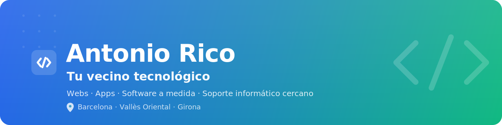

  

<h1 align="center">¡Hola! Soy Antonio 👋</h1>

  <b>Tu vecino tecnológico.</b> Hago webs, apps y software a medida — 
  y sigo siendo el que repara tu ordenador cuando más lo necesitas. 
  Sin tecnicismos. Sin letra pequeña.

  
  
  
  

  📍 <b>Barcelona · Vallès Oriental · Girona</b>

---

### 🧰 ¿Cómo puedo ayudarte?

<table>
  <tr>
    <td width="50%" valign="top">
      <h3 align="center">🏠 Hogar</h3>
      
<i>Para personas y familias</i>

      <ul>
        <li><b>Mantenimiento y reparación</b> — tu equipo lento, con virus o que no arranca.</li>
        <li><b>Redes y WiFi</b> — cobertura, configuración y problemas de conexión.</li>
        <li><b>Soporte a domicilio</b> — voy a tu casa y te lo soluciono yo mismo.</li>
      </ul>
    </td>
    <td width="50%" valign="top">
      <h3 align="center">💼 Negocios</h3>
      
<i>Para autónomos y pymes</i>

      <ul>
        <li><b>Páginas web</b> — desde una web personal a una tienda online.</li>
        <li><b>Apps y software a medida</b> — soluciones para tu negocio.</li>
        <li><b>Digitalización</b> — pon tu negocio a funcionar online, sin sustos.</li>
      </ul>
    </td>
  </tr>
</table>

---

### 🛠️ Con qué trabajo

  
  
  
  
  
  
  

---

### 📊 Mi GitHub

  
  

---

### 📬 Hablemos

¿Tienes una idea, un proyecto o algo que no funciona? Cuéntamelo —
te doy un presupuesto claro, sin compromiso y sin sorpresas.

  🌐 <a href="https://antonioricotech.com">antonioricotech.com</a> &nbsp;·&nbsp;
  💬 <a href="https://wa.me/34634600286">WhatsApp</a> &nbsp;·&nbsp;
  ✉️ <a href="mailto:info@antonioricotech.com">info@antonioricotech.com</a> &nbsp;·&nbsp;
  📅 <a href="https://cal.com/antonioricotgu024/30min">Reservar 30 min</a>

Tecnología en tus manos, sin los costes de una multinacional.

