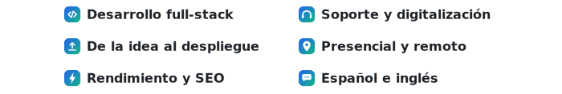
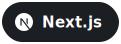
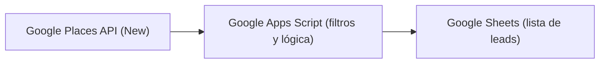
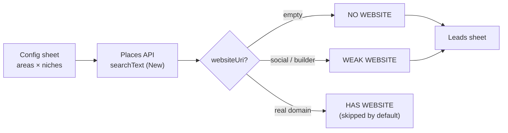
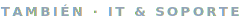
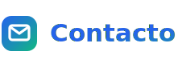

  

  &nbsp;
  &nbsp;
  &nbsp;
  

  

Hago que la tecnología trabaje para tu negocio. Soy <b>Antonio</b>, desarrollador <b>full-stack</b> con base en Barcelona: construyo sitios y aplicaciones web a medida que no solo lucen bien, sino que dan resultados. Mi herramienta principal es <b>Astro</b>, con la que creo sitios estáticos ultrarrápidos y optimizados para SEO; cuando el proyecto lo pide, sumo React, Next.js y TypeScript, con Node, Express y PostgreSQL en el back. Integro lo que un producto real necesita: pagos, IA y automatizaciones. Vengo del soporte técnico, así que entiendo los problemas del día a día y los explico sin jerga. Mi forma de trabajar es simple: presupuesto claro, sin letra pequeña y un resultado que habla por sí solo.

  

  

  
  
  
  
  
  
  
  
  
  
  
  
  
  

  
  
  
  
  
  
  

  

### [places-api-lead-finder](https://github.com/4ntonio024/places-api-lead-finder)

Google Apps Script que convierte la **Places API (New)** en una lista filtrable de negocios locales **sin página web**, directamente en **Google Sheets**. No es un scraper: usa la API oficial y cuesta **~0 €/mes**.

**Flujo general**

**Cómo clasifica cada negocio**

<b>Cómo funciona y por qué es útil</b>

 
<ul>
<li><b>Busca</b> negocios por tipo y zona con la Places API oficial de Google.</li>
<li><b>Filtra</b> automáticamente los que no tienen web, justo los que más la necesitan.</li>
<li><b>Vuelca</b> los resultados en Google Sheets: nombre, teléfono, dirección y más.</li>
<li><b>Coste</b>: prácticamente 0 € al mes gracias a la capa gratuita de la API.</li>
<li><b>Caso de uso</b>: prospección comercial para quien ofrece desarrollo web o servicios digitales.</li>
</ul>

  

Ordenadores a medida · Home labs · Redes y servidores · Mantenimiento y soporte · <a href="https://antonioricotech.com">antonioricotech.com</a>

  

¿Tienes una idea, un proyecto o algo que mejorar? Cuéntamelo y te doy un presupuesto claro, sin compromiso.

  &nbsp;
  &nbsp;
  &nbsp;
  

Tecnología en tus manos, sin los costes de una multinacional.

